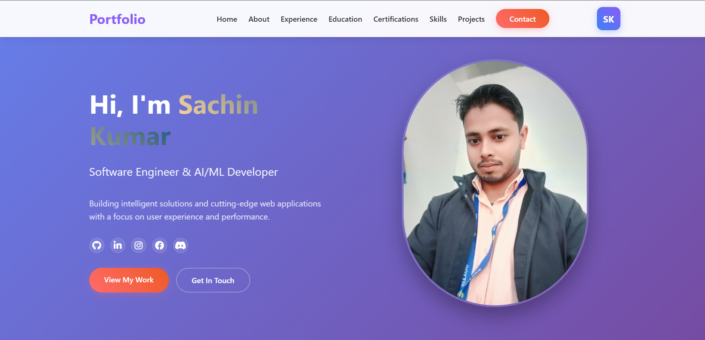

# Sachin Kumar - Portfolio Website



A modern, responsive portfolio website showcasing my skills, projects and experience as a Software Engineer & AI/ML Developer.

## 🌟 Live Demo

[**Visit My Portfolio**](https://sachin2501.github.io/Sachin_portfolio_website.io/)

## 🚀 Features

- ✅ **Fully Responsive** - Works on all devices
- ✅ **Modern UI/UX** - Clean and professional design
- ✅ **Smooth Animations** - CSS transitions and typing effects
- ✅ **Interactive Elements** - Hover effects and scroll animations
- ✅ **Contact Form** - Functional form with validation
- ✅ **Fast Loading** - Optimized for performance

## 🛠️ Tech Stack

**Frontend:**
- HTML5
- CSS3 (Grid, Flexbox, Animations)
- JavaScript (ES6+)

**Tools & Libraries:**
- Font Awesome Icons
- Google Fonts
- GitHub Pages (Deployment)

## 📁 Project Structure

```
portfolio/
├── index.html              # Main HTML file
├── css/
│   └── style.css          # All styles and animations
├── js/
│   └── script.js          # JavaScript functionality
├── images/                # Project images and assets
│   ├── photo4.jpg         # Hero section image
│   └── photo5.jpg         # About section image
└── README.md              # Project documentation
```

## 🎯 What's Inside

### Sections Included:
1. **Hero** - Introduction with typing animation
2. **About** - Personal and professional background
3. **Skills** - Technical skills and technologies
4. **Projects** - Featured projects with live demos
5. **Contact** - Contact form and information

### Key Features:
- Typing animation for name and roles
- Responsive navigation with mobile menu
- Project cards with technology tags
- Smooth scrolling between sections
- Form validation with success messages

## 🚀 Quick Start

### Method 1: Simple View
1. Download the project files
2. Open `index.html` in your browser

### Method 2: Local Server
```bash
# Using Python
python -m http.server 8000

# Using Node.js
npx live-server

# Using PHP
php -S localhost:8000

```
## 🎨 Customization

Want to use this for your own portfolio? Here's how:

### Update Personal Info
- Change name, bio, and contact details in `index.html`
- Replace images in `images/` folder

### Modify Colors  
- Update CSS variables in `style.css`
- Change gradient colors and theme

### Add Your Projects
- Update project details in projects section
- Add your own GitHub and demo links

### Update Skills
- Modify skills categories and technologies
- Add your own expertise areas

## 📧 Connect With Me

- **Email:** sachinkumar.gheura@gmail.com 
- **GitHub:** [Sachin2501](https://github.com/Sachin2501)
- **LinkedIn:** [Your LinkedIn](https://www.linkedin.com/in/sachin-kumar-sharma2501)
- **Location:** India

## 📄 License

This project is licensed under the MIT License - feel free to use this template for your own portfolio!

## 🤝 Contributing

Contributions, issues, and feature requests are welcome! Feel free to check [issues page](../../issues).

## 🙏 Acknowledgments

- Icons by [Font Awesome](https://fontawesome.com)
- Fonts by [Google Fonts](https://fonts.google.com)
- Deployment by [GitHub Pages](https://pages.github.com)

---

⭐ **If you find this portfolio helpful, please give it a star!**

**Built with ❤️ by Sachin Kumar**
